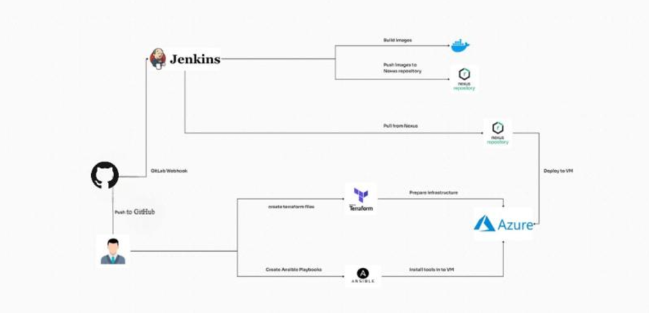
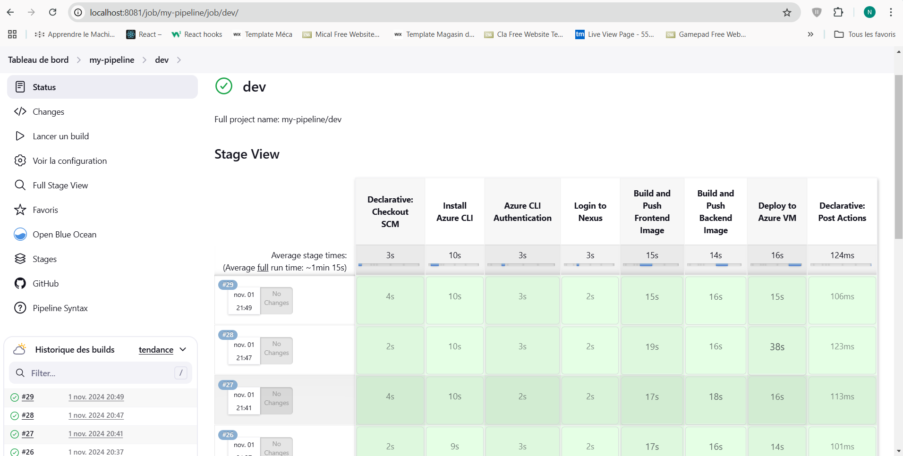

## About the Project 
Automated Application Deployment with Jenkins 

## Project Framework
- Dockerization of the application with Docker and Docker Compose  
- Automation of deployment with Jenkins  
- Management of requests and traffic with Nginx Proxy Manager  
- Adoption of Infrastructure as Code (IaC) with Terraform  
- Establishment of an IT automation platform with Ansible  
- Deployment of the application on an Azure virtual machine  

## Project Architecture

## CI/CD Pipeline

